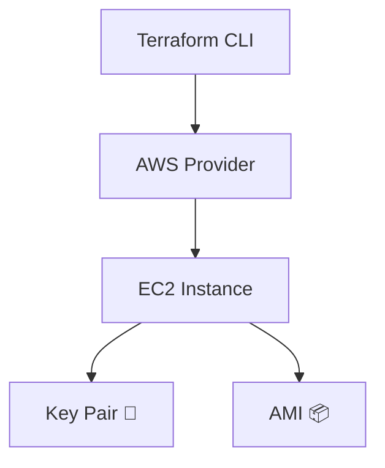

<p align="center">
  
</p>

<p align="center">
  
</p>

<p align="center">
  
  
  
  
</p>

---

## 🚀 Project Overview

This project demonstrates **AWS EC2 instance provisioning using Terraform**.  
It is a **beginner-friendly yet production-oriented** Infrastructure as Code (IaC) setup that automates the creation of EC2 instances with proper tagging and configuration.

The goal of this project is to understand:
- How Terraform interacts with AWS
- How EC2 instances are provisioned via code
- How IaC improves consistency and automation

---

## 📂 Project Structure

```bash
AWS_FOLDER/
├── EC2_instances/
│   ├── EC2.tf          # EC2 instance configuration
│   └── provider.tf    # AWS provider configuration
└── README.md
```

---

## ⚙️ Terraform Configuration Highlights

- Uses **AWS Provider**
- Provisions **EC2 instance**
- Defines:
  - AMI
  - Instance type
  - Key pair
  - Tags
- Clean and readable Terraform syntax
- Ready for extension (Security Group, EBS, Auto Scaling)

---

## 🧪 How to Use

```bash
# 1. Configure AWS CLI
aws configure

# 2. Initialize Terraform
terraform init

# 3. Validate configuration
terraform validate

# 4. Preview execution plan
terraform plan

# 5. Create EC2 instance
terraform apply -auto-approve

# 6. Destroy resources (optional)
terraform destroy -auto-approve
```

---

## 🧠 Example EC2 Resource

```hcl
resource "aws_instance" "example" {
  ami           = "ami-xxxxxxxxxxxx"
  instance_type = "t3.micro"
  key_name      = "tushar_ssh_aws"

  tags = {
    Name = "tushar-aws"
  }
}
```

---

## 🧱 Architecture (Conceptual 3D Flow)



---

## 🛡️ Best Practices Followed

- Infrastructure as Code (IaC)
- Version controlled Terraform files
- Proper resource tagging
- Minimal & clean configuration
- Ready for CI/CD integration

---

## 👨‍💻 Author

**Tushar Mishra**  
DevOps Engineer | AWS | Terraform  
📧 Email: tusharmishra2902@gmail.com  
🔗 LinkedIn: https://linkedin.com/in/tushar-mishra-02461235a  
🐙 GitHub: https://github.com/tushar-2902  

---

## 📜 License

This project is licensed under the **MIT License**.

---

<p align="center">
  
</p>
